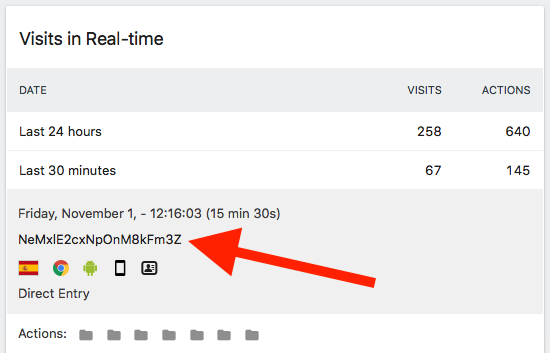

# Matomo / Piwik

### Why use Matomo with Fingerprint.js PRO

Matomo uses cookies to identify visitors. When cookies are not available or visitors use incognito mode, Matomo will create multiple visitors for one actual visitor.  Depending on your  website traffic, this can pose a significant issue as it will incorrectly count your visitors.   
  
Fingerprint.js PRO makes it easy to identify your website visitors with Matomo by linking them to the Fingerprint.js' `visitorId` value.  
  
Matomo has a limitation, which doesn't allow to replace their  cookie-based identifier, but it has a `userID` [functionality](https://matomo.org/docs/user-id/), that can be used to link Matomo visitors with Fingerprint.js visitors. 

  
To do this, you would need to use a slightly different configuration for Matomo [JavaScript tracking client](https://developer.matomo.org/guides/tracking-javascript-guide).

### Configuration

Here is a full working example that will link Fingerprint.js' visitorID  with Matomo visitorID  using userID functionality:

```javascript
<head>
<script>
// This is the Matomo tracking client JavaScript snippet
// with two modifications, wrapped in a function.
// (the rest of the configuration is the default one)
var initMatomo = function (fpjsVisitorId) {
  var _paq = window._paq || [];
  // Modification #1 (one new line).
  // Note, how we set the userID with `setUserId` configuration here
  _paq.push(['setUserId', fpjsVisitorId]);
  _paq.push(['trackPageView']);
  _paq.push(['enableLinkTracking']);
  // Modification #2 (one new line).
  // An important step is to attach the _paq to `window`. 
  // Otherwise, the Matomo client will not find this `_paq` array.
  window._paq = _paq;
  (function () {
    var u = "https://your.matomo.cloud/";
    _paq.push(['setTrackerUrl', u + 'matomo.php']);
    _paq.push(['setSiteId', '1']);
    var d = document, g = d.createElement('script'), s = d.getElementsByTagName('script')[0];
    g.type = 'text/javascript'; g.async = true; g.defer = true; g.src = '//cdn.matomo.cloud/your.matomo.cloud/matomo.js'; s.parentNode.insertBefore(g, s);
  })();
}

// Now, the Fingerprint.js PRO configuration
window.fpLayer = window.fpLayer || [];
function fp() { fpLayer.push(arguments); }
fp('config', 'client', 'your-client-token');
fp('config', 'loaded', function (fp) {
  fp.send().then(function (response) {
    initMatomo(response.visitorId);
  }).catch(function (err) {
    // use your favorite error reporting tool
    reportError(err);
  }).finally(function () {
    // optional
    // do some guaranteed post-processing here
  });
});
</script>
<script async src="https://cdn.fpjs.io/@2/fp.js"></script>
</head>
```

After you have configured it, you will start seeing UserID values in Matomo dashboard:  




It's also possible to add additional information from FingerprintJS to Matomo visits, such as incognito mode detection or bot detection results. 

